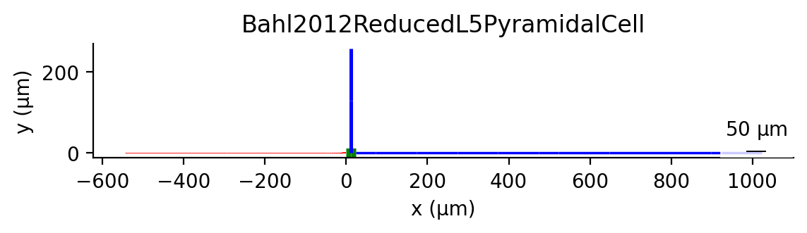
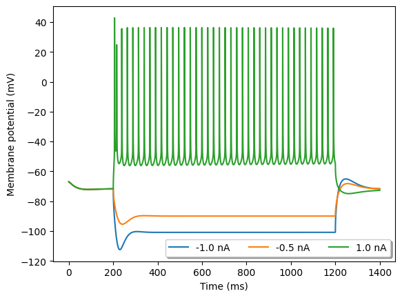
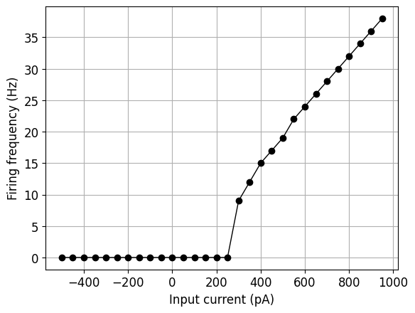
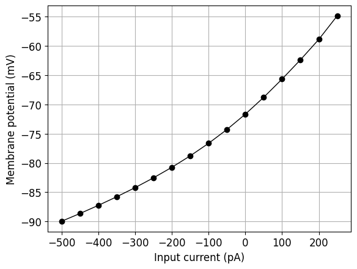

# Bahl2012ReducedL5PyramidalCell

<h2>Cell Morphology</h2>

<h2>Channel Information</h2>

<a href="Bahl2012ReducedL5PyramidalCell_ChannelInfo.md#kca"><h3>kca</h3></a>
<a href="Bahl2012ReducedL5PyramidalCell_ChannelInfo.md#sca"><h3>sca</h3></a>
<a href="Bahl2012ReducedL5PyramidalCell_ChannelInfo.md#nat"><h3>nat</h3></a>
<h3>pas</h3>
<a href="Bahl2012ReducedL5PyramidalCell_ChannelInfo.md#kfast"><h3>kfast</h3></a>
<h3>kslow</h3>
<a href="Bahl2012ReducedL5PyramidalCell_ChannelInfo.md#nap"><h3>nap</h3></a>
<a href="Bahl2012ReducedL5PyramidalCell_ChannelInfo.md#IKM"><h3>IKM</h3></a>
<a href="Bahl2012ReducedL5PyramidalCell_ChannelInfo.md#ih"><h3>ih</h3></a>
<h2>Electrophysiology</h2>

