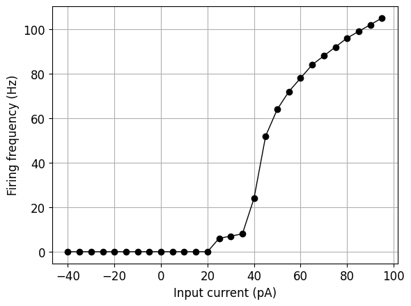

# Hay2011L5bPyrSoma

<h2>Cell Morphology</h2>

<h2>Channel Information</h2>

<a href="/home/ixanthakis/wsl_repos/Dissertation_Repos/NeuroML-Thesis/Standardised_MD_Script/Datasheets/Hay2011L5bPyrSoma/Hay2011L5bPyrSoma_ChannelInfo.md#Ca_HVA"><h3>Ca_HVA</h3></a>
<a href="/home/ixanthakis/wsl_repos/Dissertation_Repos/NeuroML-Thesis/Standardised_MD_Script/Datasheets/Hay2011L5bPyrSoma/Hay2011L5bPyrSoma_ChannelInfo.md#Ca_LVAst"><h3>Ca_LVAst</h3></a>
<a href="/home/ixanthakis/wsl_repos/Dissertation_Repos/NeuroML-Thesis/Standardised_MD_Script/Datasheets/Hay2011L5bPyrSoma/Hay2011L5bPyrSoma_ChannelInfo.md#Ih"><h3>Ih</h3></a>
<h3>Im</h3>
<a href="/home/ixanthakis/wsl_repos/Dissertation_Repos/NeuroML-Thesis/Standardised_MD_Script/Datasheets/Hay2011L5bPyrSoma/Hay2011L5bPyrSoma_ChannelInfo.md#K_Pst"><h3>K_Pst</h3></a>
<a href="/home/ixanthakis/wsl_repos/Dissertation_Repos/NeuroML-Thesis/Standardised_MD_Script/Datasheets/Hay2011L5bPyrSoma/Hay2011L5bPyrSoma_ChannelInfo.md#K_Tst"><h3>K_Tst</h3></a>
<a href="/home/ixanthakis/wsl_repos/Dissertation_Repos/NeuroML-Thesis/Standardised_MD_Script/Datasheets/Hay2011L5bPyrSoma/Hay2011L5bPyrSoma_ChannelInfo.md#Nap_Et2"><h3>Nap_Et2</h3></a>
<a href="/home/ixanthakis/wsl_repos/Dissertation_Repos/NeuroML-Thesis/Standardised_MD_Script/Datasheets/Hay2011L5bPyrSoma/Hay2011L5bPyrSoma_ChannelInfo.md#NaTa_t"><h3>NaTa_t</h3></a>
<h3>pas</h3>
<a href="/home/ixanthakis/wsl_repos/Dissertation_Repos/NeuroML-Thesis/Standardised_MD_Script/Datasheets/Hay2011L5bPyrSoma/Hay2011L5bPyrSoma_ChannelInfo.md#SK_E2"><h3>SK_E2</h3></a>
<a href="/home/ixanthakis/wsl_repos/Dissertation_Repos/NeuroML-Thesis/Standardised_MD_Script/Datasheets/Hay2011L5bPyrSoma/Hay2011L5bPyrSoma_ChannelInfo.md#SKv3_1"><h3>SKv3_1</h3></a>
<h2>Electrophysiology</h2>

