Channel information
===================

Channel information at: T = 6.3 degC, E_rev = 0 mV, [Ca2+] = 5e-05 mM

<h2 id="Nap_Et2">Nap_Et2</h2>

Ion: <b>na</b> |
Conductance expression: <b>g = gmax * m3 * h </b> |
NeuroML2 file: <a href="../HayModel/Nap_Et2.channel.nml">HayModel/Nap_Et2.channel.nml</a>

Notes
Persistent Na+ current
            
Comment from original mod file: 
:Comment : mtau deduced from text (said to be 6 times faster than for NaTa)
:Comment : so I used the equations from NaT and multiplied by 6
:Reference : Modeled according to kinetics derived from Magistretti and Alonso 1999
:Comment: corrected rates using q10 = 2.3, target temperature 34, orginal 21

<a href="imgs/Hay2011L5bPyramidalCellNap_Et2.inf.png">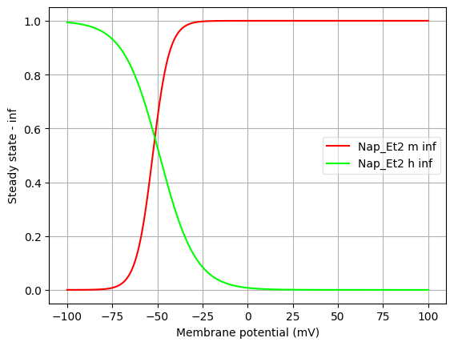</a>
<a href="imgs/Hay2011L5bPyramidalCellNap_Et2.tau.png">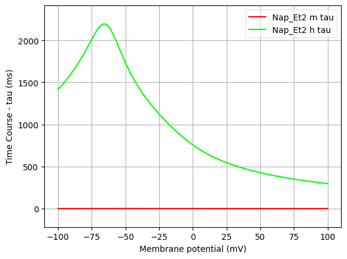</a>

<h2 id="NaTa_t">NaTa_t</h2>

Ion: <b>na</b> |
Conductance expression: <b>g = gmax * m3 * h </b> |
NeuroML2 file: <a href="../HayModel/NaTa_t.channel.nml">HayModel/NaTa_t.channel.nml</a>

Notes
Fast inactivating Na+ current
            
Comment from original mod file: 
:Reference :Colbert and Pan 2002

<a href="imgs/Hay2011L5bPyramidalCellNaTa_t.inf.png">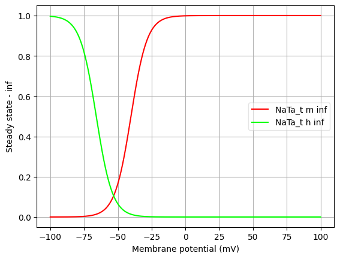</a>
<a href="imgs/Hay2011L5bPyramidalCellNaTa_t.tau.png">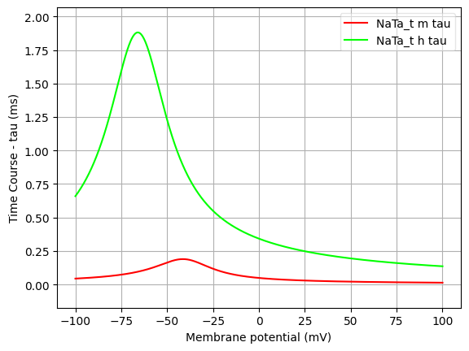</a>

<h2 id="K_Pst">K_Pst</h2>

Ion: <b>k</b> |
Conductance expression: <b>g = gmax * m2 * h </b> |
NeuroML2 file: <a href="../HayModel/K_Pst.channel.nml">HayModel/K_Pst.channel.nml</a>

Notes
Slow inactivating K+ current
            
Comment from original mod file: 
:Comment : The persistent component of the K current
:Reference : :		Voltage-gated K+ channels in layer 5 neocortical pyramidal neurones from young rats:subtypes and gradients,Korngreen and Sakmann, J. Physiology, 2000
:Comment : shifted -10 mv to correct for junction potential
:Comment: corrected rates using q10 = 2.3, target temperature 34, orginal 21

<a href="imgs/Hay2011L5bPyramidalCellK_Pst.inf.png">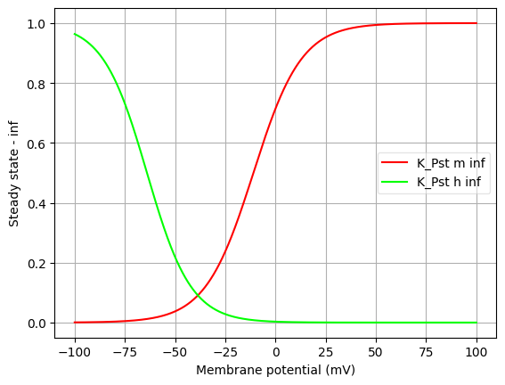</a>
<a href="imgs/Hay2011L5bPyramidalCellK_Pst.tau.png">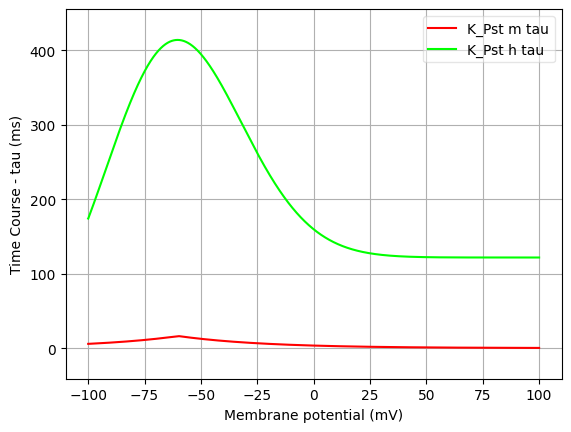</a>

<h2 id="K_Tst">K_Tst</h2>

Ion: <b>k</b> |
Conductance expression: <b>g = gmax * m4 * h </b> |
NeuroML2 file: <a href="../HayModel/K_Tst.channel.nml">HayModel/K_Tst.channel.nml</a>

Notes
Fast inactivating K+ current
            
Comment from original mod file: 
:Comment : The transient component of the K current
:Reference : :		Voltage-gated K+ channels in layer 5 neocortical pyramidal neurones from young rats:subtypes and gradients,Korngreen and Sakmann, J. Physiology, 2000
:Comment : shifted -10 mv to correct for junction potential
:Comment: corrected rates using q10 = 2.3, target temperature 34, orginal 21

<a href="imgs/Hay2011L5bPyramidalCellK_Tst.inf.png">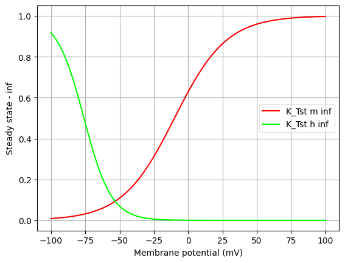</a>
<a href="imgs/Hay2011L5bPyramidalCellK_Tst.tau.png">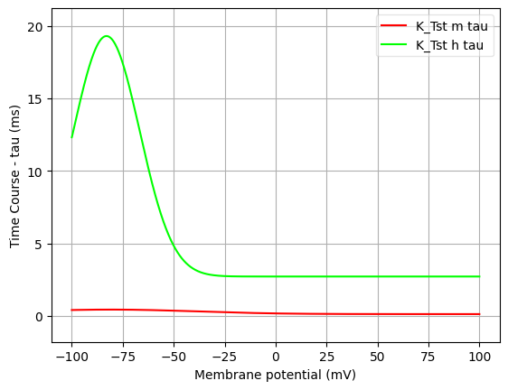</a>

<h2 id="SK_E2">SK_E2</h2>

Ion: <b>k</b> |
Conductance expression: <b>g = gmax * z </b> |
NeuroML2 file: <a href="../HayModel/SK_E2.channel.nml">HayModel/SK_E2.channel.nml</a>

Notes
Small-conductance, Ca2+ activated K+ current
            
Comment from original mod file: 
: SK-type calcium-activated potassium current
: Reference : Kohler et al. 1996

<a href="imgs/Hay2011L5bPyramidalCellSK_E2.inf.png">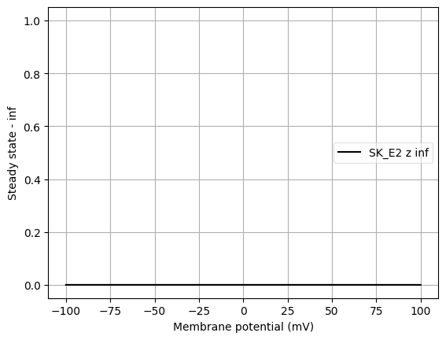</a>
<a href="imgs/Hay2011L5bPyramidalCellSK_E2.tau.png">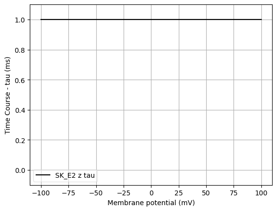</a>

<h2 id="SKv3_1">SKv3_1</h2>

Ion: <b>k</b> |
Conductance expression: <b>g = gmax * m </b> |
NeuroML2 file: <a href="../HayModel/SKv3_1.channel.nml">HayModel/SKv3_1.channel.nml</a>

Notes
Fast, non inactivating K+ current
            
Comment from original mod file: 
:Reference : :		Characterization of a Shaw-related potassium channel family in rat brain, The EMBO Journal, vol.11, no.7,2473-2486 (1992)

<a href="imgs/Hay2011L5bPyramidalCellSKv3_1.inf.png">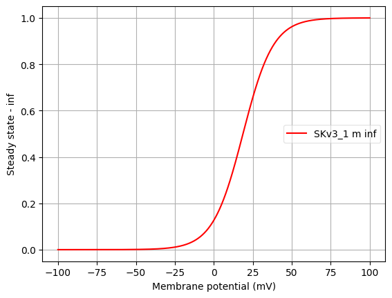</a>
<a href="imgs/Hay2011L5bPyramidalCellSKv3_1.tau.png">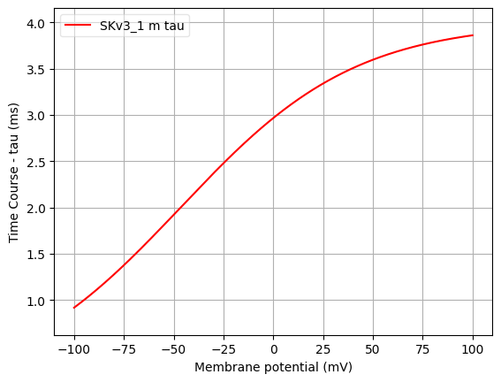</a>

<h2 id="Ca_HVA">Ca_HVA</h2>

Ion: <b>ca</b> |
Conductance expression: <b>g = gmax * m2 * h </b> |
NeuroML2 file: <a href="../HayModel/Ca_HVA.channel.nml">HayModel/Ca_HVA.channel.nml</a>

Notes
High voltage activated Ca2+ current. 
            
Comment from original mod file: 
Reuveni, Friedman, Amitai, and Gutnick, J.Neurosci. 1993

<a href="imgs/Hay2011L5bPyramidalCellCa_HVA.inf.png">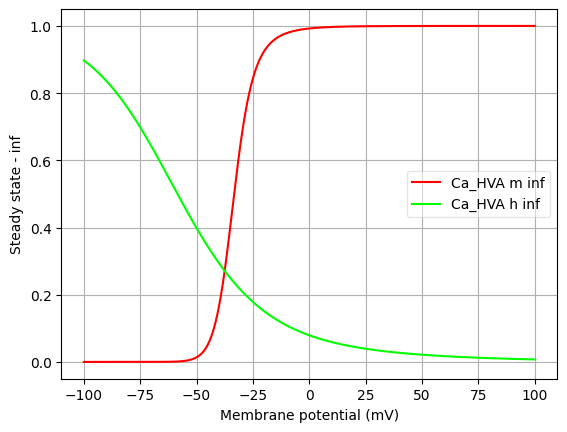</a>
<a href="imgs/Hay2011L5bPyramidalCellCa_HVA.tau.png">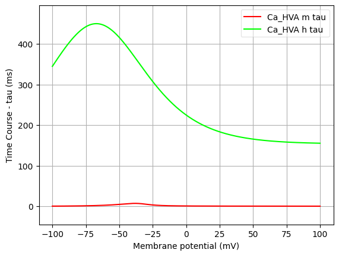</a>

<h2 id="Ca_LVAst">Ca_LVAst</h2>

Ion: <b>ca</b> |
Conductance expression: <b>g = gmax * m2 * h </b> |
NeuroML2 file: <a href="../HayModel/Ca_LVAst.channel.nml">HayModel/Ca_LVAst.channel.nml</a>

Notes
Low voltage activated Ca2+ current
            
Comment from original mod file: 
Note: mtau is an approximation from the plots
:Reference : :		Avery and Johnston 1996, tau from Randall 1997
:Comment: shifted by -10 mv to correct for junction potential
:Comment: corrected rates using q10 = 2.3, target temperature 34, orginal 21

<a href="imgs/Hay2011L5bPyramidalCellCa_LVAst.inf.png">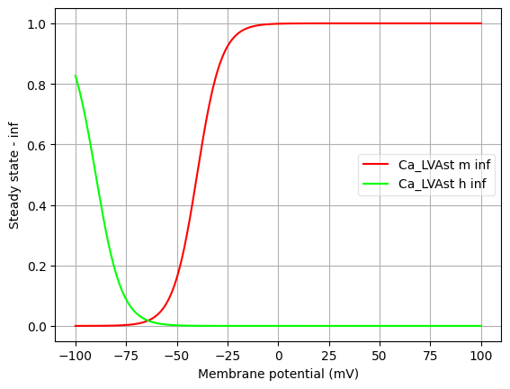</a>
<a href="imgs/Hay2011L5bPyramidalCellCa_LVAst.tau.png">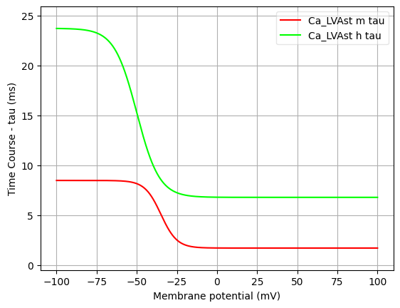</a>

<h2 id="Ih">Ih</h2>

Ion: <b>hcn</b> |
Conductance expression: <b>g = gmax * m </b> |
NeuroML2 file: <a href="../HayModel/Ih.channel.nml">HayModel/Ih.channel.nml</a>

Notes
Non-specific cation current
            
Comment from original mod file: 
Reference : :		Kole,Hallermann,and Stuart, J. Neurosci. 2006

<a href="imgs/Hay2011L5bPyramidalCellIh.inf.png">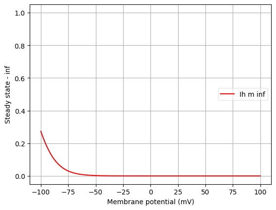</a>
<a href="imgs/Hay2011L5bPyramidalCellIh.tau.png">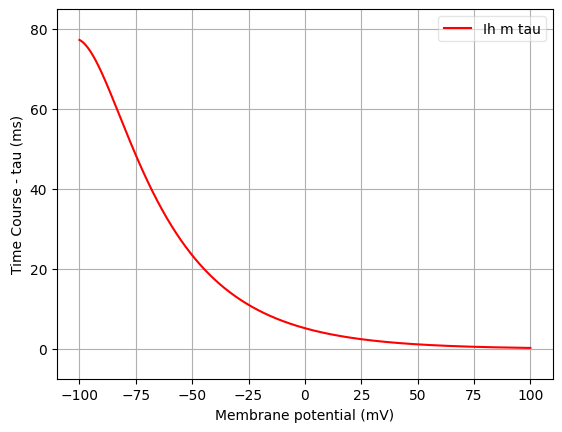</a>

