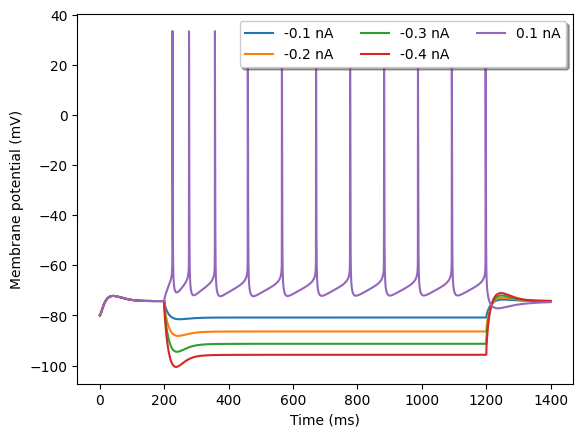
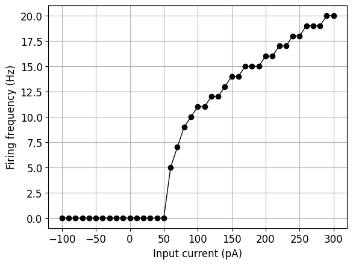
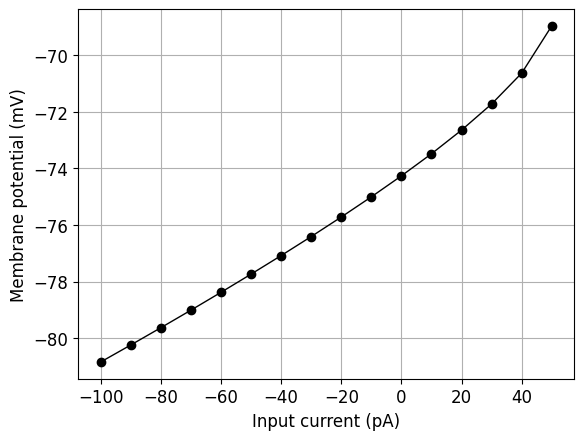

# Yao2022HumanL23Pyr

<h2>Cell Morphology</h2>

<h2>Channel Information</h2>

<h3>pas</h3>
<a href="/home/ixanthakis/wsl_repos/Dissertation_Repos/NeuroML-Thesis/Standardised_MD_Script/Datasheets/Yao2022HumanL23Pyr/Yao2022HumanL23Pyr_ChannelInfo.md#SK"><h3>SK</h3></a>
<a href="/home/ixanthakis/wsl_repos/Dissertation_Repos/NeuroML-Thesis/Standardised_MD_Script/Datasheets/Yao2022HumanL23Pyr/Yao2022HumanL23Pyr_ChannelInfo.md#K_T"><h3>K_T</h3></a>
<a href="/home/ixanthakis/wsl_repos/Dissertation_Repos/NeuroML-Thesis/Standardised_MD_Script/Datasheets/Yao2022HumanL23Pyr/Yao2022HumanL23Pyr_ChannelInfo.md#K_P"><h3>K_P</h3></a>
<a href="/home/ixanthakis/wsl_repos/Dissertation_Repos/NeuroML-Thesis/Standardised_MD_Script/Datasheets/Yao2022HumanL23Pyr/Yao2022HumanL23Pyr_ChannelInfo.md#Kv3_1"><h3>Kv3_1</h3></a>
<a href="/home/ixanthakis/wsl_repos/Dissertation_Repos/NeuroML-Thesis/Standardised_MD_Script/Datasheets/Yao2022HumanL23Pyr/Yao2022HumanL23Pyr_ChannelInfo.md#Ih"><h3>Ih</h3></a>
<h3>Im</h3>
<a href="/home/ixanthakis/wsl_repos/Dissertation_Repos/NeuroML-Thesis/Standardised_MD_Script/Datasheets/Yao2022HumanL23Pyr/Yao2022HumanL23Pyr_ChannelInfo.md#NaTg"><h3>NaTg</h3></a>
<a href="/home/ixanthakis/wsl_repos/Dissertation_Repos/NeuroML-Thesis/Standardised_MD_Script/Datasheets/Yao2022HumanL23Pyr/Yao2022HumanL23Pyr_ChannelInfo.md#Ca_HVA"><h3>Ca_HVA</h3></a>
<a href="/home/ixanthakis/wsl_repos/Dissertation_Repos/NeuroML-Thesis/Standardised_MD_Script/Datasheets/Yao2022HumanL23Pyr/Yao2022HumanL23Pyr_ChannelInfo.md#Ca_LVA"><h3>Ca_LVA</h3></a>
<a href="/home/ixanthakis/wsl_repos/Dissertation_Repos/NeuroML-Thesis/Standardised_MD_Script/Datasheets/Yao2022HumanL23Pyr/Yao2022HumanL23Pyr_ChannelInfo.md#Nap"><h3>Nap</h3></a>
<h2>Electrophysiology</h2>

