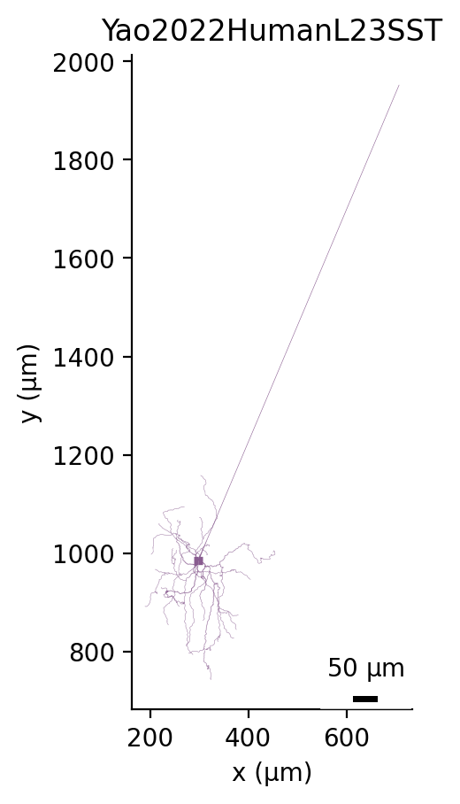
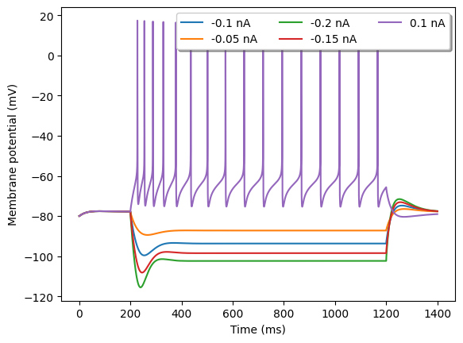
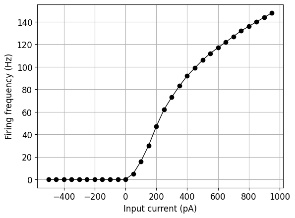
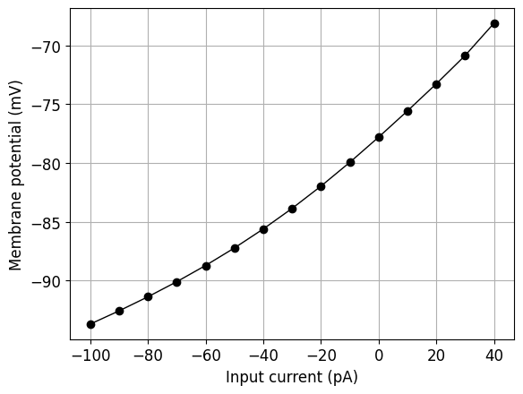

# Yao2022HumanL23SST

# Channel Information

Ion Channels: ['channels/pas.channel.nml', 'channels/NaTg/NaTg.channel.nml', 'channels/Ih.channel.nml', 'channels/K_P.channel.nml', 'channels/K_T.channel.nml', 'channels/Kv3_1.channel.nml', 'channels/SK.channel.nml', 'channels/Ca_HVA.channel.nml', 'channels/Ca_LVA.channel.nml', 'channels/Nap.channel.nml']

<table border="1"></table>

# Electrophysiology

