Channel information
===================

Channel information at: T = 6.3 degC, E_rev = 0 mV, [Ca2+] = 5e-05 mM

<h2 id="NaTg">NaTg</h2>

Ion: <b>na</b> |
Conductance expression: <b>g = gmax * m3 * h </b> |
NeuroML2 file: <a href="../Yao_2022_Model/NeuroML2/channels/NaTg/NaTg.channel.nml">Yao_2022_Model/NeuroML2/channels/NaTg/NaTg.channel.nml</a>

Notes
Fast inactivating Na+ current
Comment from original mod file:
:Reference :Colbert and Pan 2002

<a href="imgs/Yao2022HumanL23VIPNaTg.inf.png">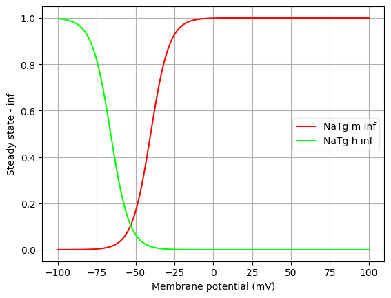</a>
<a href="imgs/Yao2022HumanL23VIPNaTg.tau.png">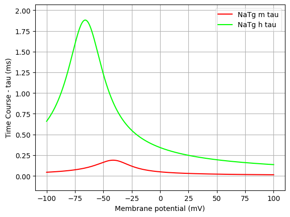</a>

<h2>NaTg_PV</h2>

Ion: <b>na</b> |
Conductance expression: <b>g = gmax * m3 * h </b> |
NeuroML2 file: <a href="../Yao_2022_Model/NeuroML2/channels/NaTg/NaTg.channel.nml">Yao_2022_Model/NeuroML2/channels/NaTg/NaTg.channel.nml</a>

Notes
Fast inactivating Na+ current
Comment from original mod file:
:Reference :Colbert and Pan 2002

<a href="imgs/Yao2022HumanL23VIPNaTg_PV.inf.png">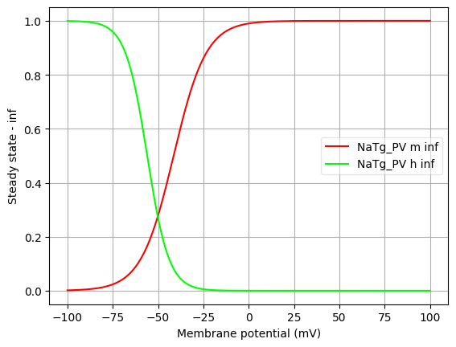</a>
<a href="imgs/Yao2022HumanL23VIPNaTg_PV.tau.png">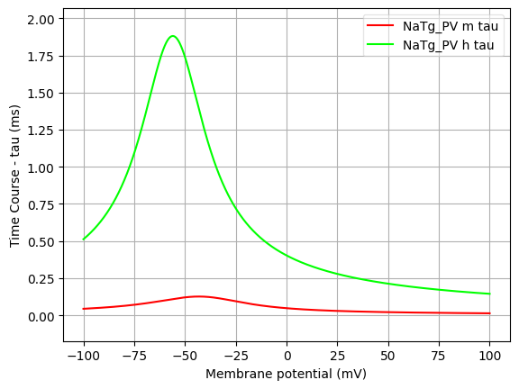</a>

<h2>NaTg_PYR_somatic</h2>

Ion: <b>na</b> |
Conductance expression: <b>g = gmax * m3 * h </b> |
NeuroML2 file: <a href="../Yao_2022_Model/NeuroML2/channels/NaTg/NaTg.channel.nml">Yao_2022_Model/NeuroML2/channels/NaTg/NaTg.channel.nml</a>

Notes
Fast inactivating Na+ current
Comment from original mod file:
:Reference :Colbert and Pan 2002

<a href="imgs/Yao2022HumanL23VIPNaTg_PYR_somatic.inf.png">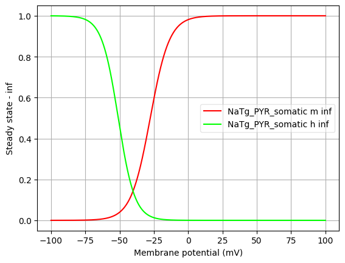</a>
<a href="imgs/Yao2022HumanL23VIPNaTg_PYR_somatic.tau.png">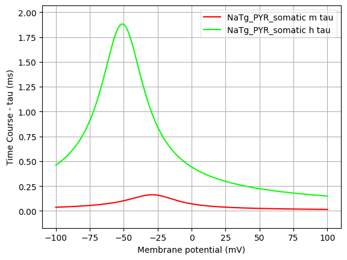</a>

<h2>NaTg_PYR_axonal</h2>

Ion: <b>na</b> |
Conductance expression: <b>g = gmax * m3 * h </b> |
NeuroML2 file: <a href="../Yao_2022_Model/NeuroML2/channels/NaTg/NaTg.channel.nml">Yao_2022_Model/NeuroML2/channels/NaTg/NaTg.channel.nml</a>

Notes
Fast inactivating Na+ current
Comment from original mod file:
:Reference :Colbert and Pan 2002

<a href="imgs/Yao2022HumanL23VIPNaTg_PYR_axonal.inf.png">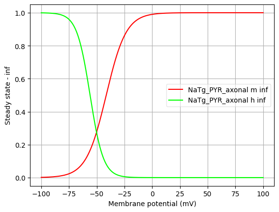</a>
<a href="imgs/Yao2022HumanL23VIPNaTg_PYR_axonal.tau.png">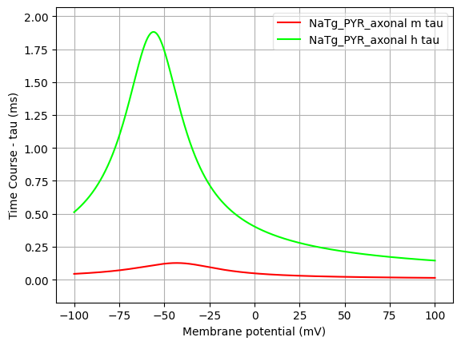</a>

<h2>NaTg_SST_somatic</h2>

Ion: <b>na</b> |
Conductance expression: <b>g = gmax * m3 * h </b> |
NeuroML2 file: <a href="../Yao_2022_Model/NeuroML2/channels/NaTg/NaTg.channel.nml">Yao_2022_Model/NeuroML2/channels/NaTg/NaTg.channel.nml</a>

Notes
Fast inactivating Na+ current
Comment from original mod file:
:Reference :Colbert and Pan 2002

<h2>NaTg_SST_axonal</h2>

Ion: <b>na</b> |
Conductance expression: <b>g = gmax * m3 * h </b> |
NeuroML2 file: <a href="../Yao_2022_Model/NeuroML2/channels/NaTg/NaTg.channel.nml">Yao_2022_Model/NeuroML2/channels/NaTg/NaTg.channel.nml</a>

Notes
Fast inactivating Na+ current
Comment from original mod file:
:Reference :Colbert and Pan 2002

<a href="imgs/Yao2022HumanL23VIPNaTg_SST_axonal.inf.png">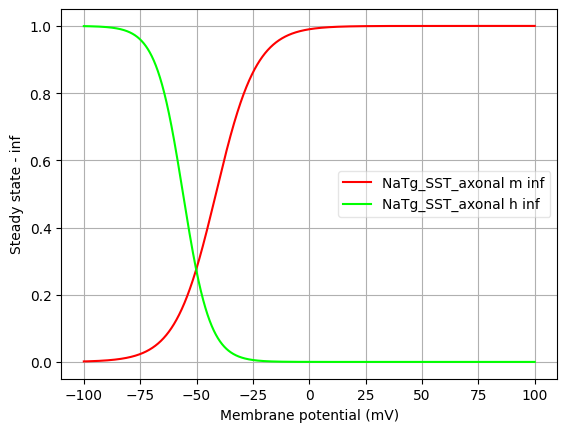</a>

<h2>NaTg_VIP_somatic</h2>

Ion: <b>na</b> |
Conductance expression: <b>g = gmax * m3 * h </b> |
NeuroML2 file: <a href="../Yao_2022_Model/NeuroML2/channels/NaTg/NaTg.channel.nml">Yao_2022_Model/NeuroML2/channels/NaTg/NaTg.channel.nml</a>

Notes
Fast inactivating Na+ current
Comment from original mod file:
:Reference :Colbert and Pan 2002

<a href="imgs/Yao2022HumanL23VIPNaTg_VIP_somatic.inf.png">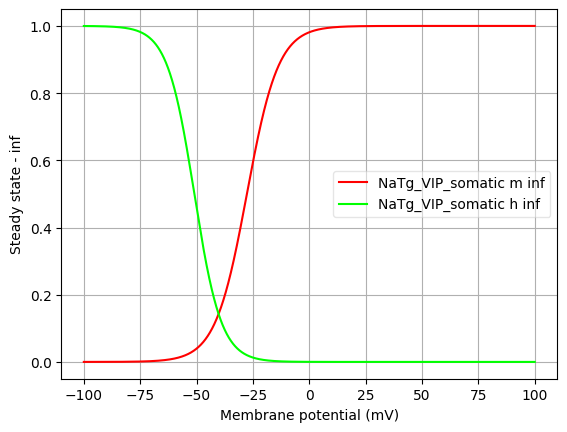</a>

<h2>NaTg_VIP_axonal</h2>

Ion: <b>na</b> |
Conductance expression: <b>g = gmax * m3 * h </b> |
NeuroML2 file: <a href="../Yao_2022_Model/NeuroML2/channels/NaTg/NaTg.channel.nml">Yao_2022_Model/NeuroML2/channels/NaTg/NaTg.channel.nml</a>

Notes
Fast inactivating Na+ current
Comment from original mod file:
:Reference :Colbert and Pan 2002

<h2 id="Nap">Nap</h2>

Ion: <b>na</b> |
Conductance expression: <b>g = gmax * m3 * h </b> |
NeuroML2 file: <a href="../Yao_2022_Model/NeuroML2/channels/Nap.channel.nml">Yao_2022_Model/NeuroML2/channels/Nap.channel.nml</a>

Notes
Persistent Na+ current

Comment from original mod file:
:Comment : mtau deduced from text (said to be 6 times faster than for NaTa)
:Comment : so I used the equations from NaT and multiplied by 6
:Reference : Modeled according to kinetics derived from Magistretti and Alonso 1999
:Comment: corrected rates using q10 = 2.3, target temperature 34, orginal 21

<a href="imgs/Yao2022HumanL23VIPNap.inf.png">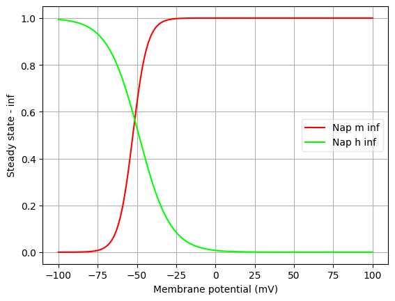</a>
<a href="imgs/Yao2022HumanL23VIPNap.tau.png">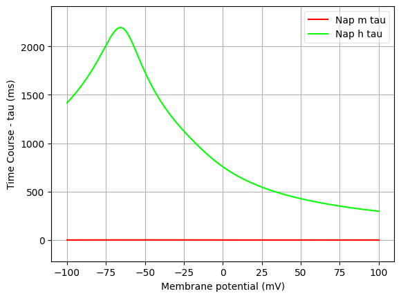</a>

<h2 id="K_P">K_P</h2>

Ion: <b>k</b> |
Conductance expression: <b>g = gmax * m2 * h </b> |
NeuroML2 file: <a href="../Yao_2022_Model/NeuroML2/channels/K_P.channel.nml">Yao_2022_Model/NeuroML2/channels/K_P.channel.nml</a>

Notes
Slow inactivating K+ current

Comment from original mod file:
:Comment : The persistent component of the K current
:Reference : :		Voltage-gated K+ channels in layer 5 neocortical pyramidal neurones from young rats:subtypes and gradients,Korngreen and Sakmann, J. Physiology, 2000
:Comment : shifted -10 mv to correct for junction potential
:Comment: corrected rates using q10 = 2.3, target temperature 34, orginal 21

<a href="imgs/Yao2022HumanL23VIPK_P.inf.png">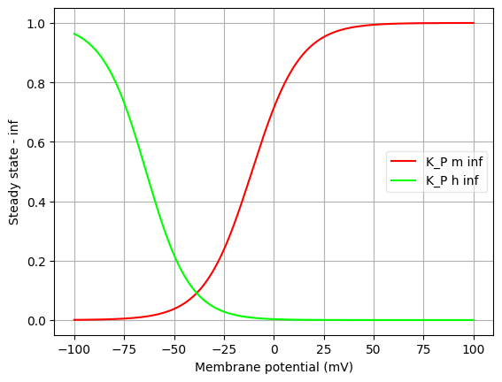</a>
<a href="imgs/Yao2022HumanL23VIPK_P.tau.png">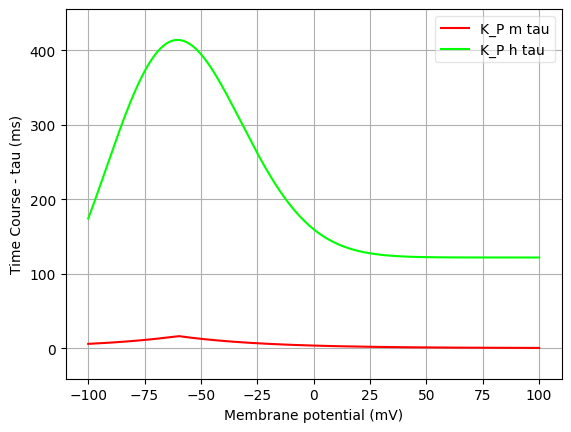</a>

<h2 id="K_T">K_T</h2>

Ion: <b>k</b> |
Conductance expression: <b>g = gmax * m4 * h </b> |
NeuroML2 file: <a href="../Yao_2022_Model/NeuroML2/channels/K_T.channel.nml">Yao_2022_Model/NeuroML2/channels/K_T.channel.nml</a>

Notes
Fast inactivating K+ current

Comment from original mod file:
:Comment : The transient component of the K current
:Reference : :		Voltage-gated K+ channels in layer 5 neocortical pyramidal neurones from young rats:subtypes and gradients,Korngreen and Sakmann, J. Physiology, 2000
:Comment : shifted -10 mv to correct for junction potential
:Comment: corrected rates using q10 = 2.3, target temperature 34, orginal 21

<a href="imgs/Yao2022HumanL23VIPK_T.inf.png">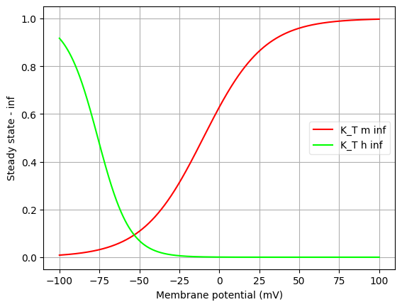</a>
<a href="imgs/Yao2022HumanL23VIPK_T.tau.png">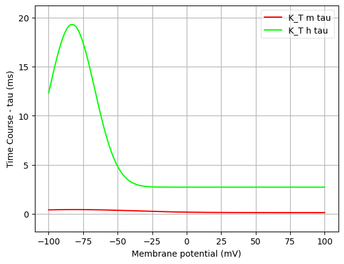</a>

<h2 id="Kv3_1">Kv3_1</h2>

Ion: <b>k</b> |
Conductance expression: <b>g = gmax * m </b> |
NeuroML2 file: <a href="../Yao_2022_Model/NeuroML2/channels/Kv3_1.channel.nml">Yao_2022_Model/NeuroML2/channels/Kv3_1.channel.nml</a>

Notes
Fast, non inactivating K+ current

Comment from original mod file:
:Reference : :		Characterization of a Shaw-related potassium channel family in rat brain, The EMBO Journal, vol.11, no.7,2473-2486 (1992)

<a href="imgs/Yao2022HumanL23VIPKv3_1.inf.png">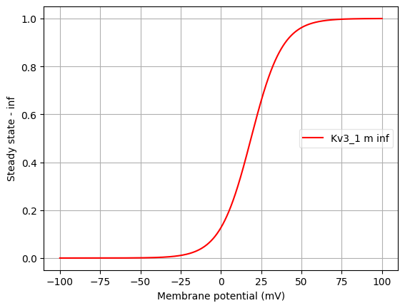</a>
<a href="imgs/Yao2022HumanL23VIPKv3_1.tau.png">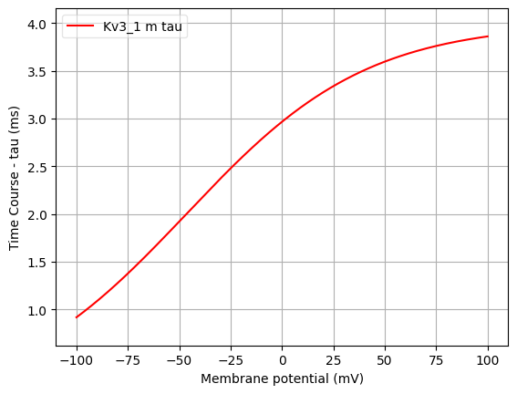</a>

<h2 id="SK">SK</h2>

Ion: <b>k</b> |
Conductance expression: <b>g = gmax * z </b> |
NeuroML2 file: <a href="../Yao_2022_Model/NeuroML2/channels/SK.channel.nml">Yao_2022_Model/NeuroML2/channels/SK.channel.nml</a>

Notes
Small-conductance, Ca2+ activated K+ current

Comment from original mod file:
: SK-type calcium-activated potassium current
: Reference : Kohler et al. 1996

<a href="imgs/Yao2022HumanL23VIPSK.inf.png">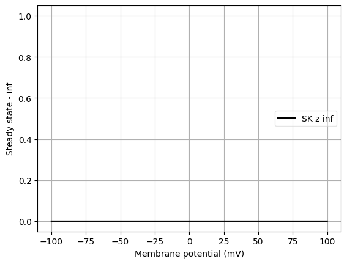</a>
<a href="imgs/Yao2022HumanL23VIPSK.tau.png">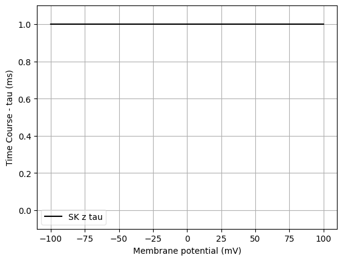</a>

<h2 id="Ca_HVA">Ca_HVA</h2>

Ion: <b>ca</b> |
Conductance expression: <b>g = gmax * m2 * h </b> |
NeuroML2 file: <a href="../Yao_2022_Model/NeuroML2/channels/Ca_HVA.channel.nml">Yao_2022_Model/NeuroML2/channels/Ca_HVA.channel.nml</a>

Notes
High voltage activated Ca2+ current. 
            
Comment from original mod file: 
Reuveni, Friedman, Amitai, and Gutnick, J.Neurosci. 1993

<a href="imgs/Yao2022HumanL23VIPCa_HVA.inf.png">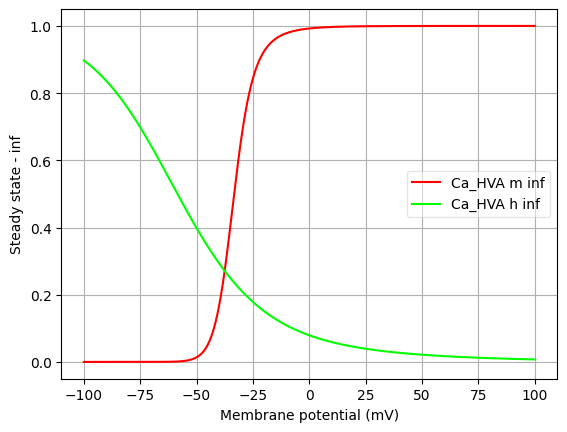</a>

<h2 id="Ca_LVA">Ca_LVA</h2>

Ion: <b>ca</b> |
Conductance expression: <b>g = gmax * m2 * h </b> |
NeuroML2 file: <a href="../Yao_2022_Model/NeuroML2/channels/Ca_LVA.channel.nml">Yao_2022_Model/NeuroML2/channels/Ca_LVA.channel.nml</a>

Notes
Low voltage activated Ca2+ current

Comment from original mod file:
Note: mtau is an approximation from the plots
:Reference : :		Avery and Johnston 1996, tau from Randall 1997
:Comment: shifted by -10 mv to correct for junction potential
:Comment: corrected rates using q10 = 2.3, target temperature 34, orginal 21

<a href="imgs/Yao2022HumanL23VIPCa_LVA.inf.png">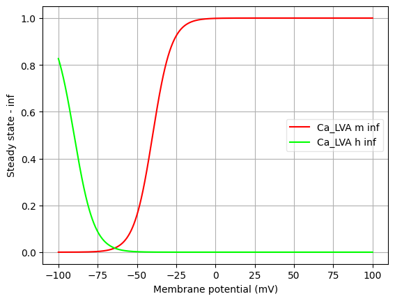</a>
<a href="imgs/Yao2022HumanL23VIPCa_LVA.tau.png">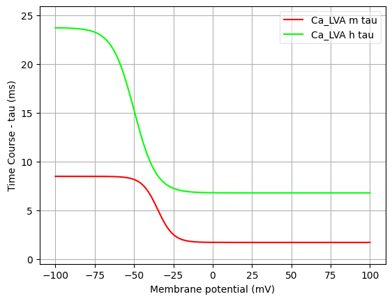</a>

<h2 id="Ih">Ih</h2>

Ion: <b>hcn</b> |
Conductance expression: <b>g = gmax * m </b> |
NeuroML2 file: <a href="../Yao_2022_Model/NeuroML2/channels/Ih.channel.nml">Yao_2022_Model/NeuroML2/channels/Ih.channel.nml</a>

Notes
Non-specific cation current
            
Comment from original mod file: 
Reference : :		Kole,Hallermann,and Stuart, J. Neurosci. 2006

<a href="imgs/Yao2022HumanL23VIPIh.inf.png">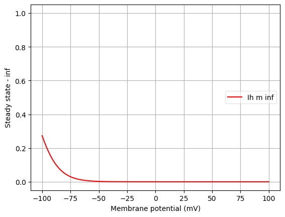</a>
<a href="imgs/Yao2022HumanL23VIPIh.tau.png">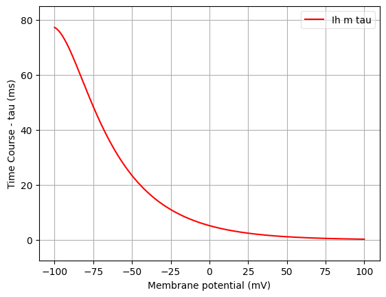</a>

