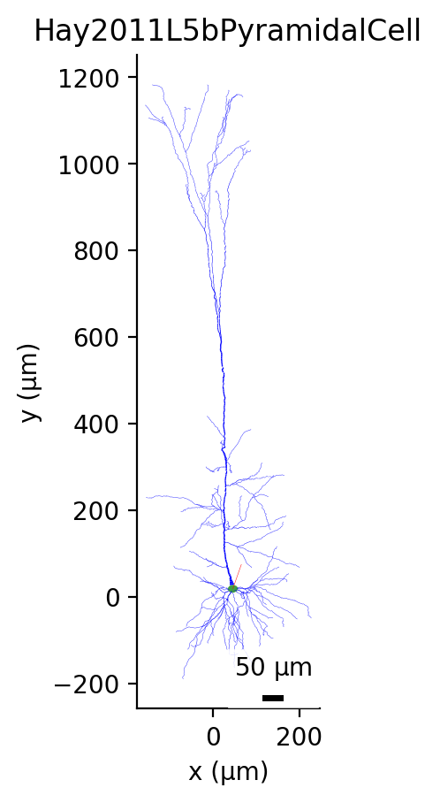
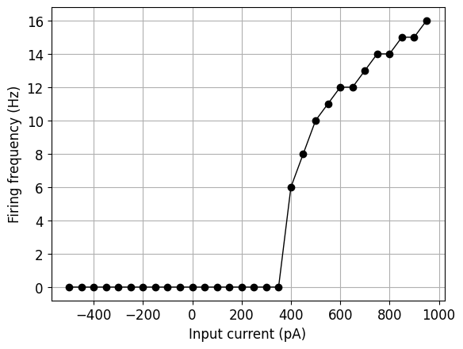
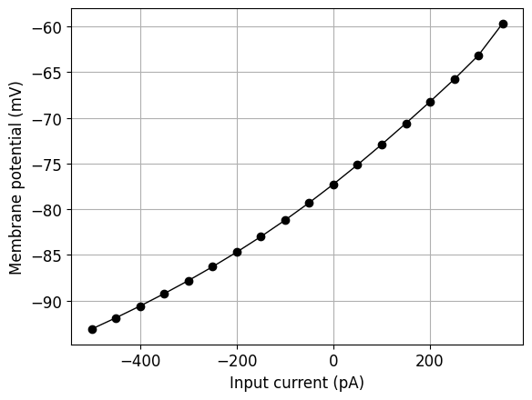

# Hay2011L5bPyramidalCell

L5PC Cell: L5PCtemplate_0 exported from NEURON ModelView

*******************************************************
* NeuroMLDocument: L5PC
*
*  ComponentType: ['Ca_LVAst_h_tau_tau', 'Ca_LVAst_m_tau_tau', 'K_Pst_h_tau_tau', 'K_Pst_m_tau_tau', 'K_Tst_h_tau_tau', 'K_Tst_m_tau_tau', 'Nap_Et2_m_tau_tau', 'SK_E2_z_inf_inf', 'SK_E2_z_tau_tau', 'SKv3_1_m_tau_tau']
*  Cell: ['L5PC']
*  IonChannel: ['Ca_HVA', 'Ca_LVAst', 'Ih', 'Im', 'K_Pst', 'K_Tst', 'NaTa_t', 'Nap_Et2', 'SK_E2', 'SKv3_1', 'pas']
*
*******************************************************

