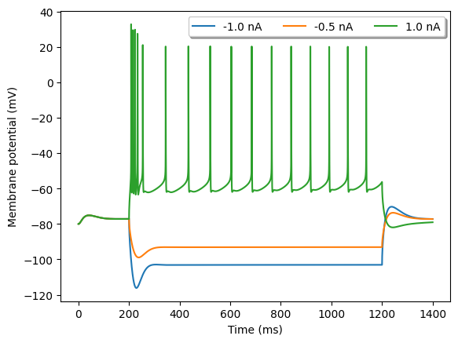

# Hay2011L5bPyramidalCell

# Channel Information

Ion Channels: ['Ca_HVA', 'Ca_LVAst', 'Ih', 'Im', 'K_Pst', 'K_Tst', 'NaTa_t', 'Nap_Et2', 'SK_E2', 'SKv3_1', 'pas']

<table border="1"></table>

# Electrophysiology

